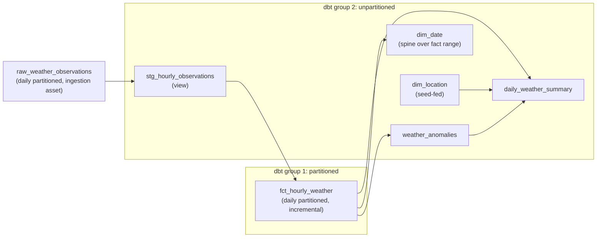

# Orchestration (Dagster)

Dagster owns the *when*: what runs, in what order, per partition, on what schedule, with what retries, and what happens when something fails. All transformation logic lives in dbt ([Transformation](transformation.md)); all fetch/land/derive logic lives in the ingestion asset ([Ingestion & Storage](ingestion-storage.md)). Dagster definitions describe dependencies, partitions, schedules, resources, retries, configuration, and asset checks, nothing more.

This document is the source of truth for the operational constants: the 06:00 UTC schedule cadence, the trailing-8 reconciliation window, the 2026-07-01 partition start, the warehouse run-concurrency pool of 1, the retry policy, and the freshness thresholds. Other documents summarize these values and link here.

## The asset graph

The edge from `raw_weather_observations` into `stg_hourly_observations` is the source asset-key mapping from [Transformation](transformation.md#source-mapping): the Dagster UI shows one continuous graph across the Python and dbt boundary, and downstream dbt runs are gated on the ingestion asset's successful materialization.

## Partitions

- **Definition:** daily partitions (`DailyPartitionsDefinition`) starting **2026-07-01**. One partition = one UTC day, matching the landing zone layout and the dbt `start_date`/`end_date` vars.
- **Why 2026-07-01:** the anomaly baseline needs 30 days of comparable history before mid-August; the start date is pushed back so the marts are interesting the day they first build.
- **Who is partitioned:** the ingestion asset and `fct_hourly_weather` (group 1). Everything else is unpartitioned (group 2) because views, dimensions, and full-rebuild marts have no per-day window of their own.
- **Partition linkage:** the partitioned dbt group reads `context.partition_time_window` for its run and passes the window to dbt as vars; the staging view between the two partitioned assets is intentionally unpartitioned (a view is global DDL, and the fact's incremental filter does the windowing).

## Two dbt asset groups

The dbt project is exposed to Dagster as two `@dbt_assets` definitions, split on the selector `config.materialized:incremental` (the documented dagster-dbt pattern for projects that mix partitioned incremental models with plain ones):

1. **Partitioned group** (`fct_hourly_weather`): daily partitions; each run executes `dbt build --select <incremental models> --vars '{"start_date": "...", "end_date": "..."}'` for exactly one UTC day. Tests for those models run in the same invocation and surface as Dagster asset checks.
2. **Unpartitioned group** (staging view, dimensions, marts): no partitions; each run executes `dbt build` (seed, then models) for the remaining models. It carries an `AutomationCondition.eager()` condition: whenever any `fct_hourly_weather` partition is updated, the daemon re-materializes this group. That is the whole coupling: fact partitions change, marts follow. Declarative automation only launches runs when Dagster's **default automation condition sensor** is enabled ([Operations Runbook](operations-runbook.md#configuration)); with the sensor off, eager conditions evaluate to nothing and marts wait for a manual `make dbt-build`.

Splitting matters for backfills: a 50-day backfill runs the partitioned group 50 times (one focused day each) while the unpartitioned group rebuilds once afterwards, instead of rebuilding every mart 50 times.

### Bootstrap and first-run ordering

The group split has a chicken-and-egg hazard on an empty warehouse: the partitioned group's `fct_hourly_weather` reads the staging view and is relationship-tested against `dim_location` and `dim_date`, all of which live in the unpartitioned group that normally runs *after* fact updates. Two choices dissolve the cycle instead of papering over it:

- **`dim_date` does not derive from the fact.** Its spine covers the partition window (2026-07-01 through the end of the current UTC week) regardless of fact contents, so it can be built before any fact rows exist and the fact's relationship tests pass from the very first partition.
- **A foundation build precedes the initial backfill.** Bootstrap order: (1) build the foundation, the `cities` seed, `stg_hourly_observations`, `dim_location`, and `dim_date`; (2) run the partition backfill (raw ingestion plus the partitioned fact group per day); (3) let the automation condition rebuild the unpartitioned group, which now populates the marts. The commands live in [Operations Runbook](operations-runbook.md#backfills).

The same rule covers new cities: a backfill that introduces a city the dimensions do not know would fail the fact's relationship tests. Re-run the seed and `dim_location` (the foundation build) before backfilling a new city's partitions; the runbook folds this into the backfill procedure.

## Daily reconciliation schedule

The schedule `daily_reconciliation` runs at **06:00 UTC every day** and emits one run request per partition for the **trailing 8 partitions** (yesterday back to 8 days ago):

- **Yesterday** is the fresh fetch: first snapshot for that partition.
- **The previous 7 days** are reconciliation re-fetches: each lands a *new* snapshot and re-derives the raw slice, absorbing upstream revisions of provisional values ([Ingestion & Storage](ingestion-storage.md#provisional-values-why-reconciliation-exists)).

Why 8 days: Open-Meteo's Best Match serves recent days from IFS blended with ERA5/ERA5-Land reanalysis that publishes with roughly a five-day delay, so recent values can be revised in place by the source. Open-Meteo documents the delays, not the blend mechanics, so the horizon is a safety margin over the delay, not a claimed switch-over point. The cost is 8 API calls per day, trivially inside the free tier.

At 06:00 UTC every requested day is complete (yesterday ended 6 hours earlier) and any intraday source corrections have had a night to settle. After the 8 partition runs complete, the automation condition rebuilds the unpartitioned group, so every morning ends with fully refreshed marts.

## Retries

Retries are for plausibly transient failures only, and deterministic errors fail fast.

- **Transport failures** (timeouts, connection errors, HTTP 429/5xx) raise a retryable error and are retried up to 3 times with increasing delay. Control is explicit: the client raises Dagster's retry-requested exception for these only.
- **Deterministic failures** (HTTP 400 with an error body, unit mismatches, malformed structure, row-count violations) raise a descriptive failure immediately: no retry, because the same request would fail identically. The error message carries endpoint, partition, and what was wrong.
- **Retry safety** rests on the write path: a retry that dies between snapshot write and derive leaves the snapshot on disk and the previous table state in place; the next attempt finds its own run's snapshot, validates it, skips the fetch, and re-derives the same slice in one transaction. A retry can never add a second snapshot for the same fetch operation, so retries are idempotent, not merely convergent (see [retry safety](concepts.md#retry-safety)).

## DuckDB single-writer and run concurrency

DuckDB allows exactly one read-write process per database file. The pipeline has two kinds of writers: Dagster processes (ingestion asset, deriving the raw table) and the dbt subprocess. They never overlap within a single run (steps are sequential), but *concurrent runs* (a backfill racing the schedule, or the two dbt groups overlapping) would fight over the file lock.

The mitigation is declarative: instance configuration declares a run-concurrency pool of one (keyed on the `warehouse=duckdb` tag every run carries), which is the appropriate mechanism for protecting a single-writer resource. The pool serializes all warehouse writers; throughput is irrelevant at this scale (a partition materializes in seconds). This is a deliberate tradeoff of the DuckDB decision; the escape hatches (separate raw/serve files, or a client-server engine) are production-path options in [Design Decisions](design-decisions.md#moving-to-production).

## Freshness

The ingestion asset carries a freshness policy at its definition (warn at 36 hours, fail at 48 since the last materialization); in the current freshness system, policies are active by default and no instance-level feature flag is needed. The feature is marked under active development upstream, so the exact API surface is re-verified at implementation time. The daily schedule cadence means a healthy pipeline never trips the policy; a paused schedule or a week of failures does. Freshness renders on the asset in the UI, so "is the pipeline alive?" is a glance, not an investigation.

## Backfills

Backfills are just batched partition materializations of the partitioned job (ingestion asset plus partitioned dbt group); the unpartitioned group follows via its automation condition. Because every layer is idempotent, a backfill is exactly the equivalent partition runs executed in batch: no duplicates, no partial state, and identical results for any day whose source values have already converged ([backfills](concepts.md#backfills) walks through why it holds here).

- **Initial backfill:** the partition range from 2026-07-01 through yesterday, launched once at project setup (the command lives in [Operations Runbook](operations-runbook.md#backfills)).
- **Repair backfills:** any sub-range, after fixing whatever went wrong. Re-running converged days is harmless: new snapshots land that are source-value-equivalent reruns of the same values, differing only in run metadata.
- **Selection:** launched from the UI (range backfill on the partitioned job) or the script in the runbook; the daemon executes partitions one at a time under the concurrency limit.

## Failure recovery

What breaks, and what recovery looks like:

| Failure | Blast radius | Recovery |
|---|---|---|
| API unreachable for a morning | 8 partitions missing that day; nothing else | Next scheduled run picks up the partitions; or launch a range backfill for the gap. Missing partitions are visible as gaps in the UI partition grid. |
| Deterministic validation failure (one partition) | That partition's run fails; marts keep yesterday's state | Fix the cause (usually a schema/units change in the API), re-materialize the partition. The failure metadata names the endpoint and the exact violated expectation. |
| Asset check failure (e.g. row count) | Check is blocking: downstream dbt runs for that partition are skipped | Inspect the snapshot in the landing zone (it stays; snapshots are never deleted), diagnose, re-materialize. |
| Run crash mid-derive | Raw table keeps its previous slice (delete+insert is transactional) | Plain re-run; idempotent. |
| Warehouse file corrupted | Everything derived is lost; landing zone untouched | Rebuild the whole raw zone from snapshots (procedure in [Operations Runbook](operations-runbook.md#rebuilding-the-warehouse-from-the-landing-zone)), then rebuild dbt. Zero API calls. |
| Machine dies mid-backfill | Completed partitions stay complete | Backfill daemon resumes the remaining range. |

The common thread: because snapshots are append-only and every table refresh is a transactional slice replace, there is no failure mode that requires manual data surgery. Recovery is always "re-run the thing", and the landing zone is the floor under everything.
