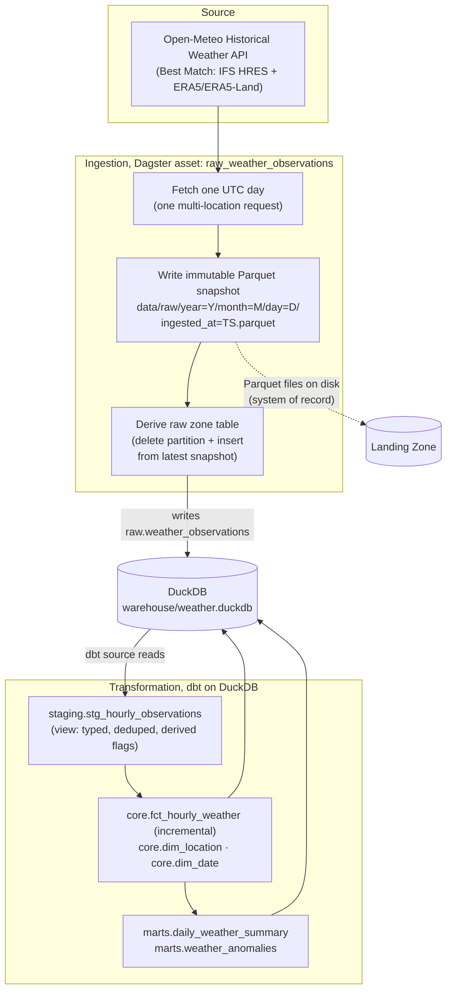

# Overview

## The problem

Hourly weather observations are free, public, and messy in the specific ways that make them a good exercise in real data engineering:

- **They arrive late and change.** The Open-Meteo Historical Weather API serves recent days immediately from a blend of models ("Best Match"), but the underlying reanalysis (ERA5, ERA5-Land) publishes with roughly a five-day delay, and when it lands, values for recent days are revised in place, silently. Whatever you stored last Tuesday may no longer be what the source says.
- **They are time-partitioned by nature.** An hour belongs to exactly one UTC day. Ingestion, storage, and transformation all want to treat a day as the unit of work, fetched together, landed together, re-fetched together.
- **They need modeling before they are useful.** Raw hourly rows answer no interesting question on their own. "Was Tuesday in Reykjavík abnormal?" requires clean facts, stable dimensions, daily summaries, and a baseline to compare against.

## The purpose

This project builds a production-style batch pipeline that solves those three problems end to end:

1. **Ingest** hourly observations for eight world cities from the Open-Meteo Historical Weather API, one UTC day at a time.
2. **Land every fetch as an immutable snapshot** and derive the raw table from the latest snapshot per day, so upstream revisions are absorbed by _adding_ history, never by editing it.
3. **Transform** through dbt into a dimensional model (an hourly fact plus location and date dimensions) and two marts: daily summaries and detected anomalies.
4. **Orchestrate** everything as Dagster assets, partitioned, scheduled, retried, checked, and backfillable, with daily reconciliation of recent partitions.

It is also deliberately a learning artifact: every design decision in this suite exists to practice a concept (idempotency, partitioning, incremental loading, late-arriving data) rather than because weather data is hard. [Concepts](concepts.md) makes that layer explicit.

Success criteria:

- Replaying an existing snapshot is deterministic: the same snapshot always produces the same derived tables.
- Re-processing any partition is idempotent: retries, scheduled re-materializations, and backfills never leave duplicates or partial state behind.
- Re-fetching a recent partition may legitimately change values, because the source revises provisional days until they converge; once a day has converged, further fetches are stable.
- The warehouse can be fully rebuilt from the landing zone without a single API call.
- A failed run at any point is safely rerunnable.
- Every analytical output (summary row, anomaly) can be traced to the snapshot that produced its inputs.
- A new engineer can explain, from these docs alone, what runs when, and why.

## End-to-end architecture

## Layer responsibilities

| Layer                            | Owns                                                                             | Never does                                                      |
| -------------------------------- | -------------------------------------------------------------------------------- | --------------------------------------------------------------- |
| **Ingestion** (Dagster asset)    | Calling the API, parsing the response, writing snapshots, deriving the raw table | Business logic, renaming, deduplication beyond response parsing |
| **Landing zone** (Parquet files) | Being the append-only record of everything ever received                         | Being queried directly by marts; being edited                   |
| **Raw zone** (DuckDB table)      | Being the derived, queryable mirror of the latest snapshots                      | Being hand-edited or appended to outside the derivation step    |
| **Staging** (dbt view)           | Typing, renaming, deduplicating, deriving flags (`is_day`)                       | Aggregation, joins across sources                               |
| **Core** (dbt)                   | The atomic fact and its dimensions                                               | Mart logic (summaries, anomaly detection)                       |
| **Marts** (dbt)                  | Analytics-ready outputs: daily summaries, anomalies                              | Cleaning (garbage should never get this far)                    |
| **Orchestration** (Dagster)      | Dependencies, partitions, schedules, retries, checks, backfills                  | Data transformation logic                                       |

The one-directional rule is no layer bypassing, not literal single-layer reads: data flows down the table, and a layer reads only the inputs the design gives it. Marts never read the raw zone directly; core never contains mart logic; ingestion never performs analytical transformation; the raw table never modifies snapshots. Peer reads inside a layer group are fine where the DAG calls for them: `daily_weather_summary` reads `weather_anomalies` (both marts), and core models join the dimensions and seeds that belong to them.

## The journey of one hour of data

Take one observation: Reykjavík, 2026-08-15, 14:00 UTC, temperature 11.3 °C.

1. **Fetch.** At 06:00 UTC on 2026-08-16, the reconciliation schedule materializes partition `2026-08-15` (among seven other recent partitions). The ingestion asset sends one request covering all eight cities for `start_date=end_date=2026-08-15`, `timezone=UTC`.
2. **Land.** The parsed response is written as a new immutable snapshot: `data/raw/year=2026/month=08/day=15/ingested_at=2026-08-16T06-00-05Z.parquet`. It is the _first_ snapshot of this day, so it becomes the latest.
3. **Derive.** The raw table's `2026-08-15` slice is deleted and re-inserted from that snapshot. Our hour is now a typed row in `raw.weather_observations`.
4. **Stage.** dbt's staging view presents it renamed (`temperature_c`), typed, deduplicated on `(location_id, hour_ts_utc)`, with `is_day` computed from latitude and the UTC timestamp.
5. **Model.** The incremental `fct_hourly_weather` merges the day's rows on its unique key; `dim_location` (from the cities seed) and `dim_date` give the hour its dimensional home.
6. **Serve.** `daily_weather_summary` rolls the day up per city. `weather_anomalies` compares our 14:00 reading against its baseline window, the same city, the same hour of day, the trailing 30 days, and emits a row only if it is ≥ 3 standard deviations out.
7. **Converge.** Over the following week, each morning's run re-fetches this partition and lands new snapshots. While the source revises the day (reanalysis landing), the raw table tracks the newest snapshot. Once the source stops changing, the day has converged and new snapshots are source-value-equivalent reruns: every weather value matches the previous snapshot, and only run metadata (filename timestamp, `ingested_at_utc`) differs.

## Intended technologies and compatibility assumptions

> **Versions authority:** this section describes _intent_, not pins. Once milestone M1 creates the environment, `pyproject.toml` and `uv.lock` are the only authority for exact versions; this document links there and makes no further claims about numbers.

| Technology                                         | Role                                                                     | Compatibility assumptions                                                                                                                                                                                                        |
| -------------------------------------------------- | ------------------------------------------------------------------------ | -------------------------------------------------------------------------------------------------------------------------------------------------------------------------------------------------------------------------------- |
| **Dagster** (with `dagster-dbt`, `dagster-duckdb`) | Orchestration: assets, partitions, schedules, retries, checks, backfills | Current-generation APIs only: `AutomationCondition` (not the deprecated `AutoMaterializePolicy`), `RetryPolicy` including on dbt assets, the current freshness API. Verified against the documentation current as of 2026-08-19. |
| **dbt** (with `dbt-duckdb`)                        | Transformation: staging → core → marts, tests, docs                      | The dbt-core/dbt-duckdb 1.11 line: `data_tests:` schema syntax with `arguments:` for generic test args, list-form `unique_key`, `delete+insert` incremental strategy.                                                            |
| **DuckDB**                                         | The analytical engine and warehouse; writes and reads Parquet natively   | Single-writer file locking drives the serialized-run design in [Orchestration](orchestration.md#duckdb-single-writer-and-run-concurrency).                                                                                       |
| **Parquet**                                        | Landing-zone snapshot format                                             | Written by the ingestion step via DuckDB's native Parquet writer.                                                                                                                                                                |
| **Python 3.12**                                    | Ingestion code, tests                                                    | Type hints, `pathlib`, stdlib `logging`.                                                                                                                                                                                         |
| **uv**                                             | Environment and dependency management                                    | Sole package manager; produces the lockfile that becomes version authority.                                                                                                                                                      |
| **httpx**                                          | HTTP client for the Open-Meteo API                                       | Timeouts and transport-level mocking for tests.                                                                                                                                                                                  |
| **pytest**                                         | Unit and integration tests                                               | Mocked APIs, ephemeral DuckDB instances, partition-key materialization.                                                                                                                                                          |
| **ruff**                                           | Lint and format                                                          | Pre-commit and CI agree on one config.                                                                                                                                                                                           |
| **GitHub Actions**                                 | CI                                                                       | Offline verification only, no live API calls in CI.                                                                                                                                                                              |
| **Docker / compose**                               | Containerized Dagster deployment (webserver + daemon + code location)    | Volumes mount the landing zone and warehouse so container runs share state with local runs.                                                                                                                                      |

## Other Documentation

| Doc                                         | Holds                                                                                                                                                                                         |
| ------------------------------------------- | --------------------------------------------------------------------------------------------------------------------------------------------------------------------------------------------- |
| [Ingestion & Storage](ingestion-storage.md) | The API contract, snapshot layout, raw-zone semantics, licensing                                                                                                                              |
| [Orchestration](orchestration.md)           | Schedules, partitions, retries, concurrency, freshness: the 06:00 UTC cadence, the trailing-8 reconciliation window, the 2026-07-01 partition start, the `warehouse=duckdb` concurrency limit |
| [Transformation](transformation.md)         | Model contracts: logic, configuration, model-level tests                                                                                                                                      |
| [Anomaly Detection](anomaly-detection.md)   | The statistical specification and its constants: the 30-day baseline window, the 14-comparable guard, the z threshold of 3.0                                                                  |
| [Data Contracts](data-contracts.md)         | Exact schemas: grains, keys, and columns of every table and model                                                                                                                             |
| [Quality & Testing](quality-testing.md)     | The testing strategy: which layer catches which defect                                                                                                                                        |
| [Operations Runbook](operations-runbook.md) | Commands, environment configuration, procedures                                                                                                                                               |
| [Design Decisions](design-decisions.md)     | Rationale and tradeoffs, limitations, the production migration path                                                                                                                           |
